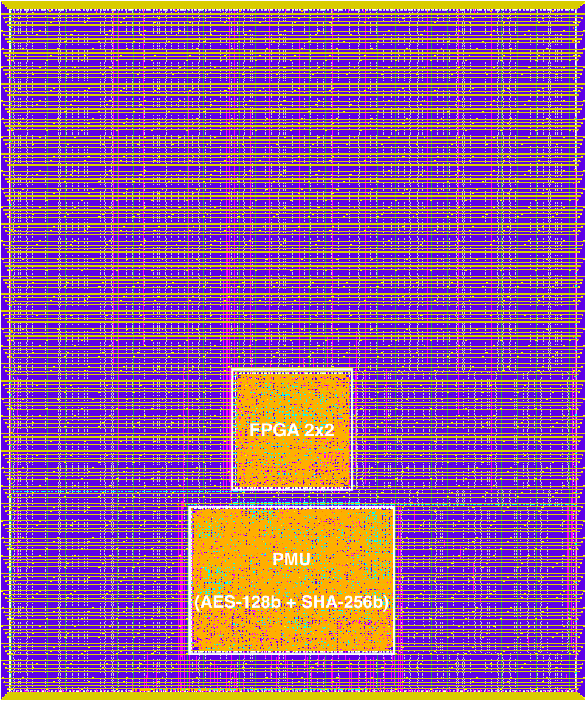

# FPGA Programming Management Unit (PMU)

## Description

The Programming Management Unit will serve as a macro that can be placed near a FPGA to handle bitstream loading.
While the primary functionality of the PMU is to load a bitstream into an FPGA Core it will also incorporate some hardware security and integrity features.
This is in response to the need for OpenFPGA to be able to incorporate some hardware security IPs to FPGA designs.
To accurately access the level of protection the security features provide to the FPGA/FPGA bitstream, an iterative approach to the PMU design will be taken starting with version one.

As of today the primary objectives of the PMU is to accurately transfer bitstream data to the core and protect the IP that lies within a bitstream using AES. User authentication is performed with an SHA-256 core and on the fly decription of a bitstream is evaluated using AES-128 core. The PMU is capable of loading FPGAs with a configuration chain configuration protocol. This project will serve as a test implementation of the PMU where the user project wrapper includes both a PMU and a SOFA 2x2 FPGA generated using OpenFPGA, and several spy pads for testing post fabrication. A link to both the PMU repo and SOFA repo can be found here: PMU: https://github.com/lnis-uofu/FPGA_Secured_Bitstream 2x2 FPGA: https://github.com/lnis-uofu/SOFA 

  

